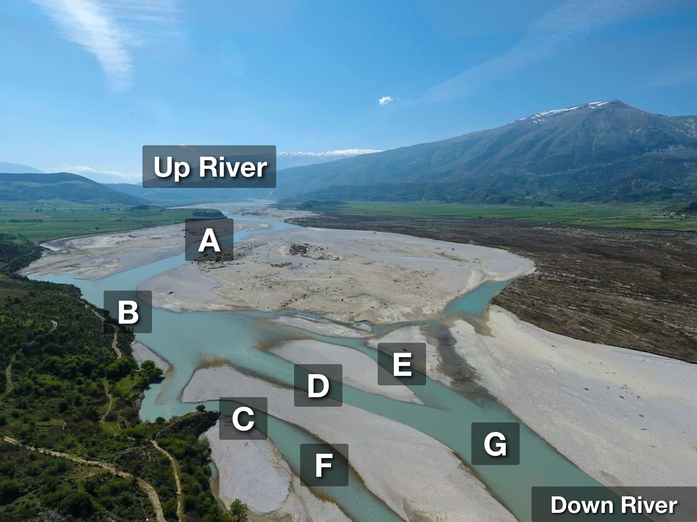

# DEML (DAG Elevation Markup Language)
## Warning: Experimental

DAGs ([Directed Acyclic Graphs](https://en.wikipedia.org/wiki/Directed_acyclic_graph)) act like rivers. Water doesn't flow upstream (tides and floods being exceptions). Sections of a river at the same elevation can't be the inputs or outputs of each other, like the nodes C, D, and E in the image below. Their input is B. C outputs to F, while D and E output to G. 



In DEML we represent an elevation marker with `----` on a new line. The order of elevation clusters is significant, but the order of nodes between two `----` elevations is not significant.

```Haskell
UpRiver > A
----
A > B
----
B > C | D | E
----
C
D
E
----
F < C
G < D | E > DownRiver
----
DownRiver < F
```

Nodes are defined by the first word on a line. The defined node can point to its outputs with `>` and to its inputs with `<`. Inputs and outputs are separated by `|`. 

The [DAG-RS YAML example](https://github.com/open-rust-initiative/dagrs#yaml-configuration-file) for running shell commands in a DAG defined order.
```YAML
dagrs:
  a:
    name: "Task 1"
    after: [ b, c ]
    cmd: echo a
  b:
    name: "Task 2"
    after: [ c, f, g ]
    cmd: echo b
  c:
    name: "Task 3"
    after: [ e, g ]
    cmd: echo c
  d:
    name: "Task 4"
    after: [ c, e ]
    cmd: echo d
  e:
    name: "Task 5"
    after: [ h ]
    cmd: echo e
  f:
    name: "Task 6"
    after: [ g ]
    cmd: python3 ./tests/config/test.py
  g:
    name: "Task 7"
    after: [ h ]
    cmd: node ./tests/config/test.js
  h:
    name: "Task 8"
    cmd: echo h
```

 Would be represented in DEML as follows

```Haskell
H > E | G = echo h
----
G = node ./tests/config/test.js
G = echo e
----
F < G = python3 ./tests/config/test.py
C < E | G = echo c
----
B < C | F | G = echo b
D < C | E = echo d
----
A < B | C = echo a
```

Shell commands can be assigned to a node with `=`. Minimal DAG-RS functionality is currently implemented in DEML.